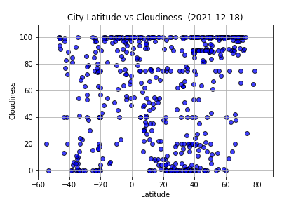
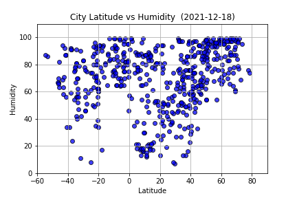
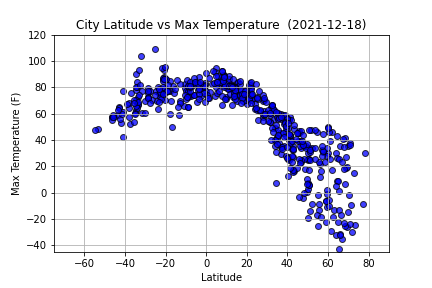

# python-api-challenge

"What's the weather like as we approach the equator?"

This repository contains python-api-chalenge homework.

This contains 3 folders: 
    1. Main code
    2. Output data
    3. ReadMe doc

The main code contains folders WeatherPy and VacationPy. Inside each is the main code which is run from Jupyter Notebook.
You will need two API keys:
 1. OpenWeatherMap API Key called weather_api_key 
 2. Google API Key called g_key
The WeatherPy code finds the weather for about 500 world cities.
The VacationPy code finds the nearest hotel for each of these cities and plots them on a map.

The output data file contains:
    1. CSV file of the worlds cities.
   

    2. 4 Scatterplots of key weather data.
    
    
    
    

    3. Screenshots of the heatmap and a heatmap with hotels.
    
    
