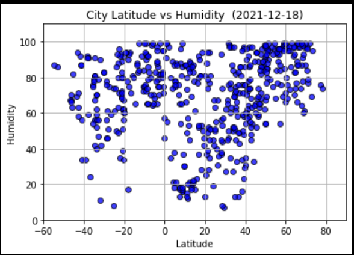
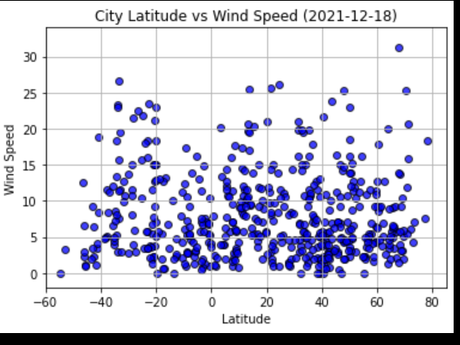

# python-api-challenge

"What's the weather like as we approach the equator?"

This repository contains python-api-challenge.

This contains 3 folders:

1. Main code containing two folders: 

     a) WeatherPy contains Python script to visualize the weather of 500+ cities across the world of varying distance from the equator. Performed a weather check on each of the cities using a series of successive API calls. Included a print log of each city as it's being processed with the city number and city name. The code has utilized a [simple Python library](https://pypi.python.org/pypi/citipy), and the [OpenWeatherMap API](https://openweathermap.org/api), to create a representative model of weather across world cities. The output folder contains a CSV of all retrieved data and a PNG image for each scatter plot

     b) VacationPy to plan future vacations by using jupyter-gmaps and the Google Places API. Created a heat map that displays the humidity for every city from the WeatherPy and Google Places API to find the first hotel for each city located within 5000 meters of city coordinates. Pinned the hotels on top of the humidity heatmap with each pin containing the **Hotel Name**, **City**, and **Country**.

2. Output data

3. Images

Inside the Main code folder are folders WeatherPy and VacationPy, where the main code which is run using Jupyter Notebook files:

[WeatherPy](main_code/VacationPy/VacationPy-code.ipynb) 

[VacationPy](main_code/WeatherPy/WeatherPy-code.ipynb)

You will need two API keys:
 1. OpenWeatherMap API Key called weather_api_key 
 2. Google API Key called g_key
The WeatherPy code finds the weather for about 500 world cities.
The VacationPy code finds the nearest hotel for each of these cities and plots them on a map.

The output data file contains:

1. CSV file of the worlds cities.

   

2. 4 Scatterplots of key weather data relationships:

We cannot see a distictive pattern between Cloudiness and Latitude. Continents tend to be less cloudy than adjacent oceans (at the same latitude), except in the equatorial belt. Cloudiness is highest around 60° S but there is less cloud cover at the South Pole. This figure reflects the ascent and subsidence occurring at these respective latitudes, and the large amount of ocean at around 60° S.

  

Humidity does not show a strong correlation to latitude. The visualization shows a variety of humidity percentages at different latitudes.Humidity is the concentration of water vapour present in the air and indicates the likelihood for precipitation, dew, or fog to be present.
The humidity is affected by winds and by rainfall. The most humid cities on earth are generally located closer to the equator, near coastal regions. The visualisation shows higher humidity near the tropical equator.
Humidity depends on the temperature and pressure of the system of interest. When the temperature rises, humidity decreases and when temperature decreases, humidity increases. The same amount of water vapor results in higher humidity in cool air than warm air. The plot shows a relative humidity higher closer to polar regions.

  

This plot shows that Temperatures cool with increasing Latitude! There is a relationship between Latitude and Temperature around the world, as temperatures are typically warmer approaching the Equator and cooler approaching the Poles.
The Equator has a latitude of 0°, the North Pole has a latitude of 90° North (written 90° N or +90°), and the South Pole has a latitude of 90° South (written 90° S or −90°)
This plot uses the degree Fahrenheit (symbol: °F) as the unit of measure for temperature. On the Fahrenheit scale, the melting point of water is 32°F and the boiling point is 212°F (at standard atmospheric pressure). The world temperatures plotted appear to be mostly within this range.

  

The plot shows that there is no direct relationship between wind speed and latitude. 
A force called the Coriolis force causes the wind to deflect to the right of its intent path in the Northern Hemisphere and to the left in the Southern Hemisphere. The Corioils force is zero at the equator. The magnitude of Coriolis force depends on (1) the rotation of the Earth, (2) the speed of the moving object, and (3) its latitudinal location. The stronger the speed (such as wind speed), the stronger the Coriolis force. The higher the latitude, the stronger the Coriolis force. The affect is shown in our plot around 60° N Latitude.

  

3. Linear Regression on each relationship: 

This time, separating the plots into Northern Hemisphere (greater than or equal to 0 degrees latitude) and Southern Hemisphere (less than 0 degrees latitude)

Correlation is a measurement of the strength of the relationship between two variables and their association with each other. It takes values between -1 and 1. 
r-squared is how well the regression model fits the observed data and takes values between 0 and 1.

Northern Hemisphere - Max Temp vs. Latitude Linear Regression scatter plot shows a high negative correlation of -0.86. This indicates as the temperature decreases as the latitude increases and vice versa. The r-squared of 0.74 shows a good fit to the data.
Southern Hemisphere - Max Temp vs. Latitude Linear Regression scatter plot shows a moderate positive correlation of 0.52. This indicates as the temperature increases as the latitude increases. The r-squared of 0.27 shows a poor fit to the data.

 
 

Northern Hemisphere - Humidity vs. Latitude Linear Regression scatter plot shows a moderate positive correlation of 0.45. This indicates as the humidity increases as the latitude increases. The r-squared of 0.20 shows a poor fit to the data.
Southern Hemisphere - Humidity vs. Latitude Linear Regression scatter plot shows a low positive correlation of 0.27. This indicates as the humidity increases as the latitude increases. The r-squared of 0.08 shows a poor fit to the data.

  
  

Northern Hemisphere - Cloudiness vs. Latitude Linear Regression scatter plot shows a low positive correlation of 0.26. This indicates as the cloudiness increases slightly as the latitude increases. The r-squared of 0.07 shows a poor fit to the data.
Southern Hemisphere - Cloudiness vs. Latitude Linear Regression scatter plot shows a low positive correlation of 0.38. This indicates as the cloudiness increases as the latitude increases. The r-squared of 0.15 shows a low fit to the data.

  
  

 
Northern Hemisphere - Wind Speed vs. Latitude Linear Regression scatter plot shows a low negative correlation of 0.05. This indicates as the windspeed decreases slightly as the latitude increases and vice versa. The r-squared of 0.003 shows a very poor fit to the data.
Southern Hemisphere - Wind Speed vs. Latitude Linear Regression scatter plot shows a low negative correlation of -0.13. This indicates as the windspeed decreases as the latitude increases and vice versa. The r-squared of 0.017 shows a poor fit to the data.

  
  

4. Screenshots of the heatmap and a heatmap with hotels.
  
  
  

